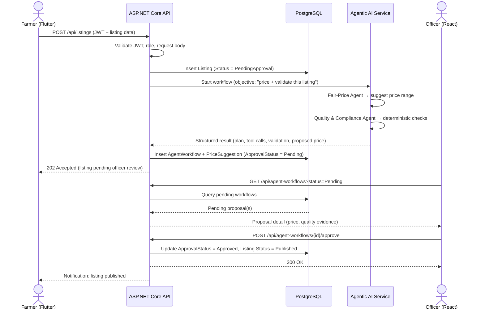

# Design Specification Document
## AgriConnect — Smart Agriculture Marketplace & Advisory Platform

---

## Table of Contents

1. [Introduction](#1-introduction)
2. [System Architecture Overview](#2-system-architecture-overview)
3. [User Roles and Permissions](#3-user-roles-and-permissions)
4. [Component Design](#4-component-design)
   - [4.1 Component A — Produce Listings & Price Discovery](#41-component-a--produce-listings--price-discovery)
   - [4.2 Component B — Order & Collection-Centre Logistics](#42-component-b--order--collection-centre-logistics)
   - [4.3 Component C — Quality Grading & Inspection](#43-component-c--quality-grading--inspection)
   - [4.4 Component D — Market Price Analytics & Reporting](#44-component-d--market-price-analytics--reporting)
5. [Agentic AI Orchestration & Workflow](#5-agentic-ai-orchestration--workflow)
6. [Database Design](#6-database-design)
7. [Cross-Platform Integration & Security](#7-cross-platform-integration--security)
8. [Third-Party Integration](#8-third-party-integration)
9. [Testing Strategy Summary](#9-testing-strategy-summary)
10. [Deployment Plan](#10-deployment-plan)
11. [Architecture Decision Record Summary](#11-architecture-decision-record-summary)
12. [Requirements Traceability Matrix](#12-requirements-traceability-matrix)

---

## 1. Introduction

### 1.1 Purpose
This document translates the AgriConnect SRS and Project Proposal into a concrete design specification: the database entities, REST API surface, client-side (React/Flutter) responsibilities, and Agentic AI agent contracts for each of the four student-owned business components. It is intended as the working reference for implementation, individual contribution evidence, and viva preparation.

### 1.2 Scope
Covers the four business components (A–D), the shared/cross-cutting concerns each component depends on (identity, audit logging, notifications), the Agentic AI orchestration that ties the four agents together, and traceability back to the SRS functional requirements (FR1–FR22).

### 1.3 References
- AgriConnect Software Requirements Specification (SRS)
- AgriConnect Project Proposal
- SE3090 Assignment 1 Specification 2026 (Sections 3, 4, 5–9, 14.2)

---

## 2. System Architecture Overview

### 2.1 Architectural Style
AgriConnect is a **layered client–server architecture** with a single authoritative backend and an isolated Agentic AI subsystem. Two independent clients (Flutter, React) serve different user groups but share one API, one database, and one set of business rules. No client ever talks to the database, the Agentic AI subsystem, or any third-party service directly — every request is mediated by the ASP.NET Core Web API, which is the single source of truth for identity, permissions, validation, and persistence.

### 2.2 Architecture Diagram

```text
┌────────────────────────────────────────────────────────────────────────────────┐
│                                  CLIENT LAYER                                  │
│                                                                                │
│     ┌──────────────────────────────┐      ┌──────────────────────────────┐     │
│     │      Flutter Mobile App      │      │        React Web App         │     │
│     │        Farmer / Buyer        │      │   Officer / Administrator    │     │
│     │        (Android APK)         │      │        (Browser SPA)         │     │
│     └──────────────────────────────┘      └──────────────────────────────┘     │
│                                                                                │
└───────────────────│─────────────────────────────────────│──────────────────────┘
                    │  HTTPS / REST / JSON                │
                    │  Bearer JWT                         │
┌───────────────────▼─────────────────────────────────────▼──────────────────────┐
│                    ASP.NET CORE WEB API MONOLITH  (Render)                     │
│                                                                                │
│ ┌───────────────┐   ┌───────────────┐   ┌───────────────┐   ┌───────────────┐  │
│ │     Auth &    │   │   Listings &  │   │    Orders &   │   │    Quality    │  │
│ │      RBAC     │   │Marketplace (A)│   │ Logistics (B) │   │ Inspection (C)│  │
│ └───────────────┘   └───────────────┘   └───────────────┘   └───────────────┘  │
│                                                                                │
│     ┌───────────────────┐   ┌───────────────────┐   ┌───────────────────┐      │
│     │    Analytics &    │   │Agent Orchestration│   │    Notification   │      │
│     │   Reporting (D)   │   │     Controller    │   │ Service (WS/Push) │      │
│     └───────────────────┘   └───────────────────┘   └───────────────────┘      │
│                                                                                │
│ ┌────────────────────────────────────────────────────────────────────────────┐ │
│ │ JWT Authentication Middleware -> RBAC Authorization -> Route to Controller │ │
│ └────────────────────────────────────────────────────────────────────────────┘ │
│                                                                                │
└──────┬────────────────────────────────┬─────────────────────────────────┬──────┘
       │                                │                                 │
       ▼                                ▼                                 ▼
┌────────────────────────┐    ┌───────────────────────────────┐    ┌────────────────────────┐
│       PostgreSQL       │    │       Agentic AI Service      │    │   External Services    │
│    (Render managed)    │    │  (LangGraph — internal only)  │    │                        │
│                        │    │                               │    │  Maps / Distance API   │
│  All relational data   │    │ Coordinator / Planner Agent   │    │    (nearest centre,    │
│       Audit log        │    │ - Fair-Price Estimation Agent │    │     delivery ETA)      │
│  Agent workflow state  │    │ - Quality & Compliance Agent  │    └────────────────────────┘
│        (jsonb)         │    │ - Buyer-Farmer Matching Agent │
└────────────────────────┘    │ - Logistics Scheduling Agent  │
                              └───────────────────────────────┘
```

**Reading the diagram:** both clients only ever reach the ASP.NET Core API — there is no arrow from either `Flutter Mobile App` or `React Web App` to anything below the monolith. Every request passes through the JWT authentication and RBAC filter chain before it is routed to a controller. Only the API branches out below that line, and it branches to exactly three places: **PostgreSQL** (all persistence, including audit fields and Agentic AI workflow state), the **Agentic AI Service** (invoked internally with an objective in, and returning a structured result out — it never writes to the database itself and is never reachable directly by either client), and the **External Services** layer (the Maps/Distance API, called server-side only so the API key is never exposed to a client). Inside the Agentic AI Service, the Coordinator/Planner Agent delegates to the four specialised agents shown — Fair-Price Estimation (Component A), Quality & Compliance Validation (Component C), Buyer-Farmer Matching (Component B), and Logistics Scheduling (Component B) — matching the agent-to-component ownership recorded in Section 11's ADR summary. The `Agent Orchestration Controller` module inside the monolith is what exposes the start/review/approve endpoints an Officer uses to act on a proposal before it becomes final (FR19–FR20).

### 2.3 Layers

| # | Layer | Technology | Responsibility |
|---|---|---|---|
| 1 | Mobile Client | Flutter (Dart) | Farmer/Buyer-facing screens: listing creation, browsing/ordering, order tracking, camera/GPS, notifications |
| 2 | Web Client | React (JS/TS) | Officer/Administrator-facing screens: inspection recording, AI-proposal review/approval, dashboards, reporting |
| 3 | Application/API | ASP.NET Core Web API (C#) | Authentication (JWT), role-based authorization, request validation, business rules, audit logging, and the **only** entry point either client is allowed to call |
| 4 | Data | PostgreSQL (EF Core) | Persistent storage for all business data, audit logs, and Agentic AI workflow state — written to exclusively by Layer 3 |
| 5 | Intelligence | Agentic AI Service (LangGraph, Python) | Runs the 4-agent workflow when invoked by Layer 3; stateless between calls — it receives an objective, executes the plan, and returns a structured result for Layer 3 to persist |
| 6 | External | Maps/Distance API | Third-party service, called only from Layer 3; API key and all credentials stay server-side |

### 2.4 Request Flow

Every interaction follows the same path, regardless of which client initiates it. The sequence below traces the fullest case — a new listing that triggers the AI fair-price workflow and an officer approval:



**In words:**
1. **Client → API.** Flutter or React sends an HTTPS/REST request with a JSON payload and a JWT bearer token.
2. **API validates & authorizes.** ASP.NET Core verifies the token, checks the caller's role against the endpoint's policy, and validates the request body.
3. **API reads/writes PostgreSQL** via EF Core for standard CRUD, search, and reporting operations.
4. **For AI-driven operations**, the API makes an internal call to the Agentic AI Service, passing the objective and relevant context.
5. **Agentic AI Service executes the workflow** — plans the steps, delegates to the relevant specialised agent(s), calls its allow-listed tools, runs deterministic validation — and returns a structured result. It does **not** write to PostgreSQL itself.
6. **API persists the result** into the `AgentWorkflow` table and, for a high-impact action, sets `ApprovalStatus = Pending` so it surfaces on the React approval queue.
7. **Officer approves/rejects/revises** via React → API → PostgreSQL update; the API then triggers any follow-on step (e.g. matching, scheduling) the same way.
8. **API notifies the relevant client(s)** of the status change, which Flutter picks up on next poll/refresh.
9. **Distance/nearest-centre lookups** are proxied by the API to the Maps/Distance API — the client never sees the third-party API key.

### 2.5 Interaction Rules

| From | To | Allowed? | Notes |
|---|---|---|---|
| Flutter | ASP.NET Core API | ✅ | HTTPS/REST/JSON, JWT required on protected routes |
| React | ASP.NET Core API | ✅ | HTTPS/REST/JSON, JWT required on protected routes |
| Flutter / React | PostgreSQL | ❌ | Never — no direct database access from any client |
| Flutter / React | Agentic AI Service | ❌ | Never — the Python service is internal-only, per the assignment's mandatory backend rule |
| Flutter / React | Maps/Distance API | ❌ | Never — proxied through the API to protect the key |
| ASP.NET Core API | PostgreSQL | ✅ | Via EF Core; the only layer with write access |
| ASP.NET Core API | Agentic AI Service | ✅ | Internal HTTP call, not publicly routable |
| ASP.NET Core API | Maps/Distance API | ✅ | Server-side call with credential protection, timeout, and retry handling |

### 2.6 Why the Clients Stay Meaningfully Different
Per Section 4.1 of the assignment spec, React and Flutter must serve genuinely different purposes rather than being two skins on the same features:
- **React** → back-office tooling: inspection queue, AI-proposal approve/reject/revise controls, price-trend and shortage/oversupply dashboards, report export.
- **Flutter** → field/transactional tooling: listing creation with camera upload, buyer search/ordering, GPS-based nearest-centre lookup, order/notification tracking.

### 2.7 Deployment Topology
The logical architecture above maps to the following hosts (detailed in [Section 10](#10-deployment-plan)): the ASP.NET Core API, PostgreSQL, and the Agentic AI service are all deployed on **Render** — with the Agentic AI service kept as a private, non-public Render service reachable only by the API — while the React app is deployed on **Vercel**, configured to call the Render-hosted API's public URL. Flutter ships as a distributable Android APK rather than a hosted service.

---

## 3. User Roles and Permissions

| Role | Primary Client | Key Permissions |
|---|---|---|
| **Farmer** | Flutter | Create/edit/withdraw own listings, view AI-suggested price, track own orders and inspection outcomes, receive notifications |
| **Buyer** | Flutter | Search/filter/sort published listings, place orders, track order status, receive notifications |
| **Collection-Centre Officer** | React | Record inspections, approve/reject/request-revision on every AI proposal (price, match, schedule), manage centre logistics, view centre-scoped audit trail |
| **Administrator** | React | Manage user accounts and roles, view platform-wide analytics and reports, configure system settings |

Role-based access is enforced centrally in ASP.NET Core via JWT claims; Farmer/Buyer self-register (FR1), Officer/Administrator accounts are created only by an Administrator.

---

## 4. Component Design

Each component below is designed to independently satisfy the assignment's individual-component minimum: **≥4 meaningful API endpoints** and **≥1 business-specific operation beyond CRUD** (Section 5 of the spec).

---

### 4.1 Component A — Produce Listings & Price Discovery
**Owner:** Student 1 | **SRS coverage:** FR3, FR4, FR6, FR7

#### Purpose
Lets farmers list produce and buyers discover it; generates the AI-suggested fair price that anchors the whole marketplace.

#### Database Entities
| Entity | Key Fields |
|---|---|
| `Listing` | Id, FarmerId (FK→User), CropId (FK→Crop), Quantity, Unit, ClaimedGrade, PickupWindowStart/End, RegionId (FK→Region), Status (Draft/PendingApproval/Published/Withdrawn/SoldOut), CreatedAt, UpdatedAt |
| `ListingPhoto` | Id, ListingId (FK), Url, UploadedAt |
| `Crop` | Id, Name, Category |
| `Region` | Id, Name, CollectionCentreId (FK) |
| `PriceSuggestion` | Id, ListingId (FK), SuggestedPriceMin, SuggestedPriceMax, Confidence, ReasoningSummary, AgentRunId (FK→AgentWorkflow), Status (Proposed/Approved/Rejected/Revised) |

#### REST API Endpoints
| Method | Route | Description | Roles |
|---|---|---|---|
| POST | `/api/listings` | Create a listing (crop, quantity, grade, photo(s), pickup window) | Farmer |
| GET | `/api/listings` | Search/filter/sort/paginate published listings (crop, region, price range, grade) | Buyer, Officer, Admin |
| GET | `/api/listings/{id}` | Get listing detail | All authenticated |
| PUT | `/api/listings/{id}` | Edit a listing not yet ordered against | Farmer (owner) |
| DELETE | `/api/listings/{id}` | Withdraw a listing not yet ordered against | Farmer (owner) |
| POST | `/api/listings/{id}/photos` | Attach additional photos | Farmer (owner) |
| **GET** | **`/api/listings/{id}/price-suggestion`** | **Business-specific: retrieve/trigger the AI fair-price suggestion for this listing** | Farmer, Officer |

#### React Responsibilities
Officer-facing listing queue (pending vs. published), price-suggestion review panel feeding into the approval workflow, region/crop reference-data management.

#### Flutter Responsibilities
Listing creation form with camera/image picker, pickup-window date/time picker, buyer-facing search/filter/sort/paginate UI, listing detail view showing approved price.

#### Agentic AI: Fair-Price Estimation Agent
| Aspect | Detail |
|---|---|
| Responsibility | Cross-reference recent market prices for the same crop/region and propose a fair price range |
| Input contract | `{ cropId, regionId, quantity, claimedGrade, recentSaleData[] }` |
| Output contract | `{ suggestedPriceMin, suggestedPriceMax, confidence, reasoningSummary }` |
| Allow-listed tools | `MarketPriceLookupTool`, `HistoricalTrendTool` (read-only, scoped to crop/region) |
| Validation before hand-off | Price range must be within a sane bound of historical data (rejects outliers before reaching the officer) |

---

### 4.2 Component B — Order & Collection-Centre Logistics
**Owner:** Student 2 | **SRS coverage:** FR8, FR9, FR10, FR11, FR21 (shared with third-party maps)

#### Purpose
Converts a published listing into a fulfilled order: reservation, scheduling, and status tracking.

#### Database Entities
| Entity | Key Fields |
|---|---|
| `Order` | Id, ListingId (FK), BuyerId (FK→User), Quantity, Status (Pending/Approved/Scheduled/Completed/Cancelled), CreatedAt, UpdatedAt |
| `StockReservation` | Id, ListingId (FK), OrderId (FK), ReservedQuantity, ExpiresAt |
| `PickupSchedule` | Id, OrderId (FK), CollectionCentreId (FK), SlotStart, SlotEnd, Status |
| `CollectionCentre` | Id, Name, Location (lat/lng), Capacity, RegionId (FK) |

#### REST API Endpoints
| Method | Route | Description | Roles |
|---|---|---|---|
| POST | `/api/orders` | Place an order against a published listing (quantity + delivery/pickup preference) | Buyer |
| GET | `/api/orders` | List/filter/paginate orders (own orders for Buyer/Farmer, centre-scoped for Officer) | Buyer, Farmer, Officer |
| GET | `/api/orders/{id}` | Order detail with current status | Buyer, Farmer, Officer |
| PUT | `/api/orders/{id}/status` | Transition order status (Pending→Approved→Scheduled→Completed/Cancelled) | Officer |
| POST | `/api/orders/{id}/cancel` | Cancel an order and release the stock reservation | Buyer, Officer |
| **POST** | **`/api/orders/{id}/schedule`** | **Business-specific: propose a conflict-free pickup/delivery slot given centre capacity and existing bookings** | System (Agent) / Officer approval |
| GET | `/api/collection-centres/nearest` | Recommend nearest suitable centre + estimated distance (via maps integration) | Buyer, Farmer |

#### React Responsibilities
Centre-level order queue and schedule calendar, capacity dashboard, approve/reject/revise controls for scheduling proposals.

#### Flutter Responsibilities
Order placement flow, order-status tracking screen, GPS-based nearest-centre suggestion, pickup/delivery preference selection.

#### Agentic AI: Buyer-Farmer Matching Agent
| Aspect | Detail |
|---|---|
| Responsibility | Match an incoming buyer order to the relevant listing/collection centre and hand off to scheduling |
| Input contract | `{ orderId, buyerLocation, listingId, requestedQuantity }` |
| Output contract | `{ matchedCentreId, matchConfidence, notes }` |
| Allow-listed tools | `CentreCapacityTool`, `DistanceLookupTool` (wraps the maps integration, server-side only) |
| Concurrency control | Stock reservation uses a database transaction with row-level locking to prevent overselling when multiple buyers order concurrently (FR9) |

> **Note:** Logistics slot-finding itself is executed by the **Logistics Scheduling Agent**, which — per the Project Proposal and ADR decision 6 (Section 11) — is owned by Student 4 (Component D) while operating on Component B's data; Student 4 must be able to explain and modify this agent's use of Component B's scheduling model at the viva.

---

### 4.3 Component C — Quality Grading & Inspection
**Owner:** Student 3 | **SRS coverage:** FR5, FR12, FR13, FR14

#### Purpose
Standardises produce quality verification and gates listing publication on inspection outcomes.

#### Database Entities
| Entity | Key Fields |
|---|---|
| `Inspection` | Id, ListingId (FK), OfficerId (FK→User), ConfirmedGrade, Notes, InspectedAt |
| `InspectionPhoto` | Id, InspectionId (FK), Url |
| `GradeDiscrepancyFlag` | Id, ListingId (FK), ClaimedGrade, ConfirmedGrade, FlaggedAt, ResolvedAt, ResolutionNotes |

#### REST API Endpoints
| Method | Route | Description | Roles |
|---|---|---|---|
| POST | `/api/inspections` | Record an inspection outcome (grade, notes, optional photos) | Officer |
| GET | `/api/inspections` | List/filter inspection history | Officer, Admin |
| GET | `/api/inspections/{id}` | Inspection detail | Officer, Admin |
| GET | `/api/listings/{id}/inspections` | Full inspection history for a listing (who/when) | Officer, Farmer (own) |
| PUT | `/api/inspections/{id}` | Amend an inspection record (with audit trail) | Officer |
| **POST** | **`/api/listings/{id}/publish`** | **Business-specific: gate — a listing becomes buyer-visible only after passing inspection AND officer approval (FR5)** | Officer |
| GET | `/api/inspections/discrepancies` | List listings flagged for claimed-vs-confirmed grade mismatch (FR14) | Officer, Admin |

#### React Responsibilities
Inspection recording form, discrepancy review queue, publish/hold decision UI, inspection-history viewer.

#### Flutter Responsibilities
Farmer-facing view of inspection status and notes for their own listings (read-only); technician-style inspection capture is out of scope for AgriConnect (no on-farm inspector mobile role), so this is primarily a status/history display.

#### Agentic AI: Quality & Compliance Validation Agent
| Aspect | Detail |
|---|---|
| Responsibility | Deterministic validation gate before any AI proposal (price, match, schedule) is passed to a human officer |
| Input contract | `{ listingId, claimedGrade, confirmedGrade, proposedPrice, proposedSchedule }` |
| Output contract | `{ passed: bool, failedChecks[], flags[] }` |
| Checks performed | Grade exists in reference data; stock available; price within accepted range of the Fair-Price Agent's suggestion; no scheduling conflict; claimed vs. confirmed grade match (else flag per FR14) |
| Allow-listed tools | `GradeRulesTool`, `PriceRangeCheckTool`, `ScheduleConflictCheckTool` — all read-only |

---

### 4.4 Component D — Market Price Analytics & Reporting
**Owner:** Student 4 | **SRS coverage:** FR15, FR16, FR17, FR18

#### Purpose
Surfaces market intelligence (price trends, shortages/oversupply, pricing anomalies) to officers and administrators, and produces exportable reports.

#### Database Entities
| Entity | Key Fields |
|---|---|
| `PriceTrendSnapshot` | Id, CropId (FK), RegionId (FK), Period, AvgPrice, MinPrice, MaxPrice, SampleCount |
| `ShortageOversupplyEvent` | Id, CropId (FK), RegionId (FK), Type (Shortage/Oversupply), DetectedAt, Severity, Notes |
| `PriceAnomalyFlag` | Id, ListingId (FK), DeviationPercent, FlaggedAt, Status |
| `ReportExport` | Id, RequestedBy (FK→User), Type, DateRangeStart/End, GeneratedAt, FileUrl |

#### REST API Endpoints
| Method | Route | Description | Roles |
|---|---|---|---|
| GET | `/api/analytics/price-trends` | Historical price trends per crop/region over a selectable period (FR15) | Officer, Admin |
| GET | `/api/analytics/shortages` | Recurring shortage/oversupply patterns per crop/region (FR17) | Officer, Admin |
| GET | `/api/analytics/anomalies` | Listings whose price deviates significantly from the AI-suggested range (FR16) | Officer, Admin |
| POST | `/api/reports/export` | Generate a summary report of listings, orders, and price trends (FR18) | Admin |
| GET | `/api/reports/{id}` | Retrieve a previously generated report | Admin |
| **GET** | **`/api/analytics/anomalies/{listingId}/investigate`** | **Business-specific: drill into why a listing was flagged, cross-referencing inspection and order history** | Officer, Admin |

#### React Responsibilities
Dashboards (price-trend charts, shortage/oversupply heatmaps), anomaly review queue, report generation/export UI.

#### Flutter Responsibilities
Lightweight read-only price-trend view for farmers (helps them judge whether to list now) — kept intentionally minimal since React is the primary analytics surface.

#### Agentic AI: Logistics Scheduling Agent *(per Project Proposal's committed agent-to-student mapping)*
| Aspect | Detail |
|---|---|
| Responsibility | Find a conflict-free pickup/delivery slot at the relevant collection centre, given capacity and existing bookings |
| Input contract | `{ orderId, centreId, preferredWindow, existingBookings[] }` |
| Output contract | `{ proposedSlotStart, proposedSlotEnd, conflictChecked: bool }` |
| Allow-listed tools | `CentreCapacityTool`, `BookingCalendarTool` |
| Note | Functionally this agent's output feeds Component B's `/api/orders/{id}/schedule` endpoint — the agent is owned by Student 4 for individual-contribution purposes while operating on Component B's data, mirroring the Project Proposal's table (confirmed as ADR decision 6, Section 11). |

---

## 5. Agentic AI Orchestration & Workflow

### 5.1 Orchestration Model
A single LangGraph `StateGraph` acts as the **planner/coordinator**: it receives the triggering domain objective (e.g. "new listing submitted"), builds a structured multi-step plan, and routes execution to the four specialised agents in sequence, pausing at the defined human-approval checkpoint. The coordinator logic itself — not a fifth agent — satisfies the assignment's "planning and delegation" requirement (Section 9.1); this decision should be recorded explicitly in the ADR.

### 5.2 Shared Workflow State (persisted in PostgreSQL)
```
AgentWorkflow {
  Id, TriggerType, TriggerEntityId, ObjectiveText,
  PlanSteps: [ { step, agent, status } ],
  ToolCallLog: [ { tool, input, output, timestamp } ],
  ValidationResult, ApprovalStatus (Pending/Approved/Rejected/RevisionRequested),
  ApprovedBy, FinalOutcome, CreatedAt, UpdatedAt
}
```
No hidden reasoning, credentials, or tokens are persisted — only structured plan/tool/validation/approval data, per Section 6 of the assignment spec.

### 5.3 End-to-End Example Workflow
> *Farmer submits: "List 200 kg of Grade A tomatoes for pickup after 2:00 PM, minimum price LKR 180/kg."*

| Step | Actor | Action |
|---|---|---|
| 1 | Flutter | Farmer logs in, uploads produce photos, submits listing (Component A) |
| 2 | ASP.NET Core | Validates JWT, farmer role, images, listing data → saves to PostgreSQL |
| 3 | Coordinator | Builds plan: [Fair-Price → Quality/Compliance Validation → Officer Approval → Match → Schedule] |
| 4 | Fair-Price Estimation Agent | Proposes price range from recent market data (Component A) |
| 5 | Quality & Compliance Validation Agent | Deterministic checks: grade valid, price in range, no conflicts (Component C) |
| 6 | **Human approval** | Status → `PendingOfficerApproval`; Officer reviews price, quality evidence, schedule on React dashboard → Approve / Reject / Request Revision |
| 7 | Buyer-Farmer Matching Agent | Once approved and listing published, matches an incoming buyer order (Component B) |
| 8 | Logistics Scheduling Agent | Reserves a conflict-free pickup slot (Component D, operating on Component B data) |
| 9 | ASP.NET Core | Database transaction: reserve stock, confirm slot, finalise order |
| 10 | Flutter | Farmer and buyer receive updated status and confirmed pickup details |

**Cross-platform pattern:** Flutter → ASP.NET Core → PostgreSQL → Agentic AI → React approval → Flutter status update — satisfying the assignment's required end-to-end evidence (Section 10).

---

## 6. Database Design

### 6.1 Design Principles
- **Normalization:** Schema is normalized to 3NF. Reference/lookup data (`Crop`, `Region`, `CollectionCentre`) is factored out of transactional tables to avoid update anomalies; derived/aggregate data (`PriceTrendSnapshot`) is intentionally denormalized as a materialized summary table, refreshed on a schedule, since it exists purely for read-heavy analytics.
- **Keys:** Every table uses a surrogate primary key (`Id`, `uuid` or `bigserial`) plus explicit foreign keys with `ON DELETE RESTRICT` on financially/audit-sensitive relationships (e.g. `Order → Listing`) and `ON DELETE CASCADE` only on strictly dependent child rows (e.g. `ListingPhoto → Listing`).
- **Audit fields:** Every table includes `CreatedAt timestamptz NOT NULL DEFAULT now()` and `UpdatedAt timestamptz NOT NULL DEFAULT now()` (maintained via EF Core `SaveChanges` interceptor), satisfying the SRS auditability requirement and Section 6 of the assignment spec.
- **Money/quantity types:** All price fields use `numeric(12,2)`; all quantity fields use `numeric(10,2)` with a `CHECK (Quantity > 0)` constraint — never floating point — to avoid rounding errors in financial data.
- **Sensitive data minimisation:** No AI reasoning traces, raw prompts, passwords, or third-party API tokens are persisted in any table (`AgentWorkflow` stores only structured plan/tool/validation/approval data), per Section 6 of the assignment spec.
- **Transactions:** Any operation that mutates more than one related table atomically (stock reservation, order finalisation, inspection-triggered publish) is wrapped in an explicit EF Core `DbContext.Database.BeginTransaction()` scope.

### 6.2 Entity-Relationship Diagram (logical)

```
User ───────────────< Listing >─────────── Crop
  │(Farmer/Buyer/          │  (many-to-1)
  │ Officer/Admin)         │
  │                        ├──< ListingPhoto
  │                        ├──1 PriceSuggestion ──> AgentWorkflow
  │                        ├──< Inspection ──< InspectionPhoto
  │                        │        └──< GradeDiscrepancyFlag
  │                        ├──< PriceAnomalyFlag
  │                        └──< Order >── User (Buyer)
  │                                 ├──1 StockReservation
  │                                 └──1 PickupSchedule ──> CollectionCentre >── Region
  │
  ├──< AuditLog
  └──< Notification

Crop/Region ──< PriceTrendSnapshot
Crop/Region ──< ShortageOversupplyEvent
User ──< ReportExport
```
*(Legend: `>─────<` many-to-one, `1───<` one-to-many, `1───1` one-to-one)*

### 6.3 Full Table Definitions

**`User`** *(shared/cross-cutting — Identity)*
| Column | Type | Constraints |
|---|---|---|
| Id | uuid | PK |
| Role | varchar(20) | NOT NULL, CHECK IN ('Farmer','Buyer','Officer','Administrator') |
| FullName | varchar(150) | NOT NULL |
| Email | varchar(150) | NOT NULL, UNIQUE |
| PasswordHash | varchar(255) | NOT NULL |
| Phone | varchar(20) | NULL |
| RegionId | uuid | FK → Region, NULL |
| IsActive | boolean | NOT NULL DEFAULT true |
| CreatedAt / UpdatedAt | timestamptz | NOT NULL |

**`Crop`** *(shared reference data)*
| Column | Type | Constraints |
|---|---|---|
| Id | uuid | PK |
| Name | varchar(80) | NOT NULL, UNIQUE |
| Category | varchar(50) | NOT NULL |

**`Region`** *(shared reference data)*
| Column | Type | Constraints |
|---|---|---|
| Id | uuid | PK |
| Name | varchar(80) | NOT NULL |
| CollectionCentreId | uuid | FK → CollectionCentre, NULL |

**`Listing`** *(Component A)*
| Column | Type | Constraints |
|---|---|---|
| Id | uuid | PK |
| FarmerId | uuid | FK → User, NOT NULL, indexed |
| CropId | uuid | FK → Crop, NOT NULL, indexed |
| RegionId | uuid | FK → Region, NOT NULL, indexed |
| Quantity | numeric(10,2) | NOT NULL, CHECK > 0 |
| Unit | varchar(10) | NOT NULL (e.g. 'kg') |
| ClaimedGrade | varchar(5) | NOT NULL |
| PickupWindowStart | timestamptz | NOT NULL |
| PickupWindowEnd | timestamptz | NOT NULL, CHECK > PickupWindowStart |
| Status | varchar(20) | NOT NULL, CHECK IN ('Draft','PendingApproval','Published','Withdrawn','SoldOut'), indexed |
| MinPrice | numeric(12,2) | NULL (farmer's floor price) |
| CreatedAt / UpdatedAt | timestamptz | NOT NULL |

*Composite index:* `(CropId, RegionId, Status, ClaimedGrade)` — supports FR6 search/filter/sort/paginate.

**`ListingPhoto`** *(Component A)*
| Column | Type | Constraints |
|---|---|---|
| Id | uuid | PK |
| ListingId | uuid | FK → Listing, NOT NULL, ON DELETE CASCADE |
| Url | varchar(500) | NOT NULL |
| UploadedAt | timestamptz | NOT NULL |

**`PriceSuggestion`** *(Component A)*
| Column | Type | Constraints |
|---|---|---|
| Id | uuid | PK |
| ListingId | uuid | FK → Listing, NOT NULL, UNIQUE (1–1) |
| SuggestedPriceMin | numeric(12,2) | NOT NULL |
| SuggestedPriceMax | numeric(12,2) | NOT NULL, CHECK ≥ SuggestedPriceMin |
| Confidence | numeric(4,3) | NOT NULL, CHECK BETWEEN 0 AND 1 |
| ReasoningSummary | text | NOT NULL |
| AgentWorkflowId | uuid | FK → AgentWorkflow, NOT NULL |
| Status | varchar(20) | NOT NULL, CHECK IN ('Proposed','Approved','Rejected','Revised') |
| CreatedAt / UpdatedAt | timestamptz | NOT NULL |

**`CollectionCentre`** *(Component B, referenced by A/C/D)*
| Column | Type | Constraints |
|---|---|---|
| Id | uuid | PK |
| Name | varchar(120) | NOT NULL |
| Latitude / Longitude | numeric(9,6) | NOT NULL |
| Capacity | integer | NOT NULL, CHECK > 0 |
| RegionId | uuid | FK → Region, NOT NULL |

**`Order`** *(Component B)*
| Column | Type | Constraints |
|---|---|---|
| Id | uuid | PK |
| ListingId | uuid | FK → Listing, NOT NULL, indexed |
| BuyerId | uuid | FK → User, NOT NULL, indexed |
| Quantity | numeric(10,2) | NOT NULL, CHECK > 0 |
| Status | varchar(20) | NOT NULL, CHECK IN ('Pending','Approved','Scheduled','Completed','Cancelled'), indexed |
| DeliveryPreference | varchar(20) | NOT NULL (Pickup/Delivery) |
| CreatedAt / UpdatedAt | timestamptz | NOT NULL |

**`StockReservation`** *(Component B)*
| Column | Type | Constraints |
|---|---|---|
| Id | uuid | PK |
| ListingId | uuid | FK → Listing, NOT NULL, indexed |
| OrderId | uuid | FK → Order, NOT NULL, UNIQUE (1–1) |
| ReservedQuantity | numeric(10,2) | NOT NULL, CHECK > 0 |
| ExpiresAt | timestamptz | NOT NULL |

*Concurrency control:* reservation inserts run inside a serializable transaction that re-checks `SUM(ReservedQuantity)` for the listing against `Listing.Quantity` before commit, preventing overselling under concurrent orders (FR9).

**`PickupSchedule`** *(Component B, populated by Logistics Scheduling Agent)*
| Column | Type | Constraints |
|---|---|---|
| Id | uuid | PK |
| OrderId | uuid | FK → Order, NOT NULL, UNIQUE (1–1) |
| CollectionCentreId | uuid | FK → CollectionCentre, NOT NULL |
| SlotStart / SlotEnd | timestamptz | NOT NULL, CHECK SlotEnd > SlotStart |
| Status | varchar(20) | NOT NULL, CHECK IN ('Proposed','Confirmed','Cancelled') |

*Constraint:* a partial unique index on `(CollectionCentreId, SlotStart, SlotEnd)` where `Status = 'Confirmed'` prevents double-booking a centre's capacity window.

**`Inspection`** *(Component C)*
| Column | Type | Constraints |
|---|---|---|
| Id | uuid | PK |
| ListingId | uuid | FK → Listing, NOT NULL, indexed |
| OfficerId | uuid | FK → User, NOT NULL |
| ConfirmedGrade | varchar(5) | NOT NULL |
| Notes | text | NULL |
| InspectedAt | timestamptz | NOT NULL |

**`InspectionPhoto`** *(Component C)*
| Column | Type | Constraints |
|---|---|---|
| Id | uuid | PK |
| InspectionId | uuid | FK → Inspection, NOT NULL, ON DELETE CASCADE |
| Url | varchar(500) | NOT NULL |

**`GradeDiscrepancyFlag`** *(Component C)*
| Column | Type | Constraints |
|---|---|---|
| Id | uuid | PK |
| ListingId | uuid | FK → Listing, NOT NULL, indexed |
| ClaimedGrade / ConfirmedGrade | varchar(5) | NOT NULL |
| FlaggedAt | timestamptz | NOT NULL |
| ResolvedAt | timestamptz | NULL |
| ResolutionNotes | text | NULL |

**`PriceTrendSnapshot`** *(Component D — denormalized/materialized)*
| Column | Type | Constraints |
|---|---|---|
| Id | uuid | PK |
| CropId | uuid | FK → Crop, NOT NULL, indexed |
| RegionId | uuid | FK → Region, NOT NULL, indexed |
| Period | date | NOT NULL (aggregation bucket, e.g. week-start) |
| AvgPrice / MinPrice / MaxPrice | numeric(12,2) | NOT NULL |
| SampleCount | integer | NOT NULL, CHECK ≥ 0 |

*Composite index:* `(CropId, RegionId, Period)` UNIQUE — one snapshot per crop/region/period.

**`ShortageOversupplyEvent`** *(Component D)*
| Column | Type | Constraints |
|---|---|---|
| Id | uuid | PK |
| CropId | uuid | FK → Crop, NOT NULL |
| RegionId | uuid | FK → Region, NOT NULL |
| Type | varchar(15) | NOT NULL, CHECK IN ('Shortage','Oversupply') |
| DetectedAt | timestamptz | NOT NULL |
| Severity | varchar(10) | NOT NULL, CHECK IN ('Low','Medium','High') |
| Notes | text | NULL |

**`PriceAnomalyFlag`** *(Component D)*
| Column | Type | Constraints |
|---|---|---|
| Id | uuid | PK |
| ListingId | uuid | FK → Listing, NOT NULL, indexed |
| DeviationPercent | numeric(5,2) | NOT NULL |
| FlaggedAt | timestamptz | NOT NULL |
| Status | varchar(15) | NOT NULL, CHECK IN ('Open','Reviewed','Dismissed') |

**`ReportExport`** *(Component D)*
| Column | Type | Constraints |
|---|---|---|
| Id | uuid | PK |
| RequestedBy | uuid | FK → User, NOT NULL |
| Type | varchar(30) | NOT NULL |
| DateRangeStart / DateRangeEnd | date | NOT NULL |
| GeneratedAt | timestamptz | NOT NULL |
| FileUrl | varchar(500) | NOT NULL |

**`AgentWorkflow`** *(shared — Agentic AI state, see Section 5.2)*
| Column | Type | Constraints |
|---|---|---|
| Id | uuid | PK |
| TriggerType | varchar(30) | NOT NULL (e.g. 'ListingSubmitted','OrderPlaced') |
| TriggerEntityId | uuid | NOT NULL, indexed |
| ObjectiveText | text | NOT NULL |
| PlanSteps | jsonb | NOT NULL — `[{ step, agent, status }]` |
| ToolCallLog | jsonb | NOT NULL — `[{ tool, input, output, timestamp }]` |
| ValidationResult | jsonb | NULL |
| ApprovalStatus | varchar(25) | NOT NULL, CHECK IN ('Pending','Approved','Rejected','RevisionRequested') |
| ApprovedBy | uuid | FK → User, NULL |
| FinalOutcome | jsonb | NULL |
| CreatedAt / UpdatedAt | timestamptz | NOT NULL |

**`AuditLog`** *(shared — cross-cutting)*
| Column | Type | Constraints |
|---|---|---|
| Id | uuid | PK |
| ActorId | uuid | FK → User, NOT NULL |
| Action | varchar(50) | NOT NULL |
| EntityType | varchar(50) | NOT NULL |
| EntityId | uuid | NOT NULL, indexed |
| Timestamp | timestamptz | NOT NULL, indexed |
| Details | jsonb | NULL |

**`Notification`** *(shared — cross-cutting)*
| Column | Type | Constraints |
|---|---|---|
| Id | uuid | PK |
| UserId | uuid | FK → User, NOT NULL, indexed |
| Type | varchar(30) | NOT NULL |
| Message | varchar(500) | NOT NULL |
| ReadAt | timestamptz | NULL |
| CreatedAt | timestamptz | NOT NULL |

### 6.4 Relationship Summary
| Relationship | Cardinality | Notes |
|---|---|---|
| User (Farmer) → Listing | 1—* | A farmer owns many listings |
| Listing → ListingPhoto | 1—* | Cascade delete with listing |
| Listing → PriceSuggestion | 1—1 | One active AI price proposal per listing |
| Listing → Inspection | 1—* | Full inspection history retained (FR13) |
| Inspection → InspectionPhoto | 1—* | Cascade delete with inspection |
| Listing → GradeDiscrepancyFlag | 1—* | Zero or more flags if grades mismatch (FR14) |
| Listing → Order | 1—* | Multiple buyers may order against remaining stock |
| Order → StockReservation | 1—1 | Reservation released on cancel/expiry |
| Order → PickupSchedule | 1—1 | Populated by Logistics Scheduling Agent |
| CollectionCentre → PickupSchedule | 1—* | Bounded by centre `Capacity` |
| Region → CollectionCentre | 1—* | Nearest-centre lookup scoped by region first, then distance (FR21) |
| Crop, Region → PriceTrendSnapshot | *—1, *—1 | Aggregation keys |
| Listing → PriceAnomalyFlag | 1—* | Raised by Component D analytics against Component A's AI price range |
| AgentWorkflow → PriceSuggestion / PickupSchedule proposals / Inspection validation | 1—* | Single audit trail spanning all four agents |

### 6.5 Migrations & Seed Data
EF Core Code-First migrations are the single source of schema truth (no manual DDL). Seed data required at startup: reference `Crop` list (common Sri Lankan produce), `Region`/`CollectionCentre` pairs, and one test account per role for demonstration/evaluator access, per Sections 6 and 15 of the assignment spec.

---

## 7. Cross-Platform Integration & Security

- **Authentication:** JWT issued by ASP.NET Core on login; Flutter stores it via `flutter_secure_storage`, React holds it in memory within a Context API auth provider (in-memory only — never `localStorage` — to limit XSS token theft).
- **Authorization:** Role claims enforced per-endpoint via policy-based authorization (`[Authorize(Roles = "Officer")]` etc.).
- **Consistent identity:** Both React and Flutter authenticate against the same `/api/auth` endpoints and the same `User` table — no parallel identity stores.
- **Secrets:** Maps API key and any Agentic AI model credentials are held server-side only (ASP.NET Core configuration/secret manager), never exposed to either client, per the SRS Security requirement.
- **Validation:** All financial/price fields are server-side validated (range, non-negative, decimal precision) before persistence, per the SRS Data Protection requirement.

---

## 8. Third-Party Integration

**Service:** Maps/Distance API (e.g., Google Maps Distance Matrix or an equivalent free-tier service), called only from ASP.NET Core.

| Concern | Handling |
|---|---|
| Business purpose | Recommend the nearest suitable collection centre and estimate delivery distance (FR21) |
| Credential protection | API key stored server-side; never sent to React/Flutter |
| Failure handling | Timeout with fallback to last-known static centre list; retry with backoff; graceful degraded response if the service is unavailable |
| Data minimisation | Only coordinates and a centre identifier are sent to the third party — no personal or listing data |

---

## 9. Testing Strategy Summary

| Layer | Component A | Component B | Component C | Component D |
|---|---|---|---|---|
| Backend unit/service | Price-suggestion service, listing CRUD | Reservation concurrency, schedule conflict logic | Inspection recording, discrepancy detection | Trend aggregation, anomaly detection |
| API integration | Search/filter/paginate endpoints | Order lifecycle transitions | Publish-gate endpoint | Report export endpoint |
| React | Officer review panel tests | Schedule calendar tests | Discrepancy queue tests | Dashboard/chart tests |
| Flutter | Listing form + search tests | Order tracking tests | Read-only inspection view tests | Read-only trend view tests |
| Agent evaluation | Golden cases for Fair-Price Agent output schema | Golden cases for Matching Agent | Golden cases for Validation Agent (incl. prompt-injection resistance) | Golden cases for Scheduling Agent |

End-to-end test: the Section 5.3 workflow, executed via automated integration test spanning Flutter/React simulation → ASP.NET Core → PostgreSQL → Agentic AI.

---

## 10. Deployment Plan

| Component | Target |
|---|---|
| ASP.NET Core API | Render (Web Service) with health + Swagger endpoints |
| PostgreSQL | Render managed PostgreSQL instance, migrations applied on deploy, restricted credentials |
| React | Vercel, pointed at the deployed Render API |
| Flutter | Android APK build, submitted with installation instructions |
| Agentic AI | Render (internal/private service), called only by the ASP.NET Core API — never exposed publicly; documented startup order (API → Agentic AI service → dependency check) |

---

## 11. Architecture Decision Record Summary

*(Full one-page-per-decision ADRs to be maintained separately per Section 14.2 of the assignment spec — this is a summary index.)*

| # | Decision Area | Options Considered | Direction |
|---|---|---|---|
| 1 | React state management | Context API / Redux Toolkit / Zustand | **Context API** — sufficient for the app's moderate shared-state needs (auth, role, approval-queue counts) without Redux's boilerplate |
| 2 | Flutter state management | Provider / Riverpod / Bloc | **Provider** — lightweight, well-documented, matches team familiarity for a 9-week timeline |
| 3 | Agentic AI framework & orchestration | LangGraph / custom orchestration | **LangGraph** — used in labs, native support for stateful multi-agent graphs with a human-approval interrupt node |
| 4 | Database schema strategy for agent workflow state | Single `AgentWorkflow` table with JSON plan/log columns vs. fully normalised step tables | Single `AgentWorkflow` table with `jsonb` plan/tool-log columns (Section 6.3) — simpler migrations, still queryable via PostgreSQL `jsonb` operators |
| 5 | Cloud deployment platform | Azure / Render / Railway | **Render** — free-tier suitable for ASP.NET Core API, PostgreSQL, and the Agentic AI internal service; **Vercel** for the React frontend |
| 6 | Agent-to-component ownership alignment | Keep proposal's mapping vs. realign scheduling agent to Component B | Retained per Project Proposal — Student 4 owns the Logistics Scheduling Agent operating on Component B's data; Student 4 must be viva-ready on Component B's scheduling model |

---

## 12. Requirements Traceability Matrix

| SRS Req. | Description | Primary Component(s) |
|---|---|---|
| FR1 | Self-registration / Admin-created accounts | Cross-cutting (Identity) |
| FR2 | Authentication & role-based access | Cross-cutting (Identity) |
| FR3 | Create listing | A |
| FR4 | AI-suggested fair price | A |
| FR5 | Listing hidden until inspected + approved | C (gate), A (publish) |
| FR6 | Search/filter/sort/paginate listings | A |
| FR7 | Edit/withdraw listing | A |
| FR8 | Place orders | B |
| FR9 | Concurrency-safe stock reservation | B |
| FR10 | Conflict-free schedule proposal | B, D (agent) |
| FR11 | Order status tracking | B |
| FR12 | Record inspection outcomes | C |
| FR13 | Inspection history | C |
| FR14 | Flag grade discrepancies | C |
| FR15 | Historical price trends | D |
| FR16 | Flag price deviation from AI range | D |
| FR17 | Shortage/oversupply detection | D |
| FR18 | Export summary reports | D |
| FR19 | Every AI proposal → Officer Approve/Reject/Revise | Cross-cutting (Orchestration), touches A/B/C/D |
| FR20 | Auditable log of AI proposals & decisions | Cross-cutting (Orchestration) |
| FR21 | Nearest-centre recommendation & distance | B (+ Third-Party Integration) |
| FR22 | Status-change notifications | Cross-cutting |
